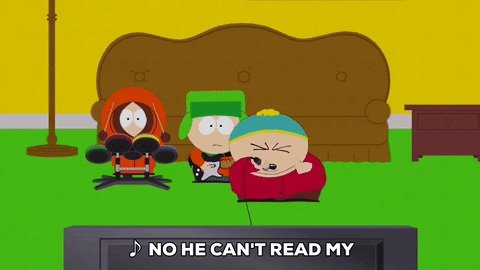

# Poker Face

## Poker Hands

Given a list of poker hands, return a list containing the highest scoring hand.

If two or more hands tie, return the list of tied hands in the order they were received.

The basic rules and hand rankings for Poker can be found at [List of Poker Hands][poker-hands]

For this exercise, we'll consider the game to be using no Jokers,
so five-of-a-kind hands will not be tested. We will also consider
the game to be using multiple decks, so it is possible for multiple
players to have identical cards.

Aces can be used in low (A 2 3 4 5) or high (10 J Q K A) straights, but do not count as
a high card in the former case.

For example, (A 2 3 4 5) will lose to (2 3 4 5 6).

You can also assume all inputs will be valid, and do not need to perform error checking
when parsing card values. All hands will be a list of 5 strings, containing a number
(or letter) for the rank, followed by the suit.

Ranks (lowest to highest): 2 3 4 5 6 7 8 9 10 J Q K A
Suits (order doesn't matter): C D H S
Example hand: ~w(4S 5H 4C 5D 4H) # Full house, 5s over 4s

[poker-hands]: https://en.wikipedia.org/wiki/List_of_poker_hands
